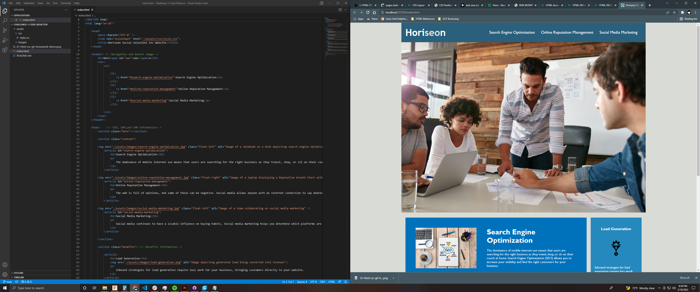

# Code Refactor Solved

work completed by Vincet Teune, 2-18-2022

link to github repository for this project: https://github.com/cobalt88/Challenge-1-Code-Refactor

link to live page for this project: https://cobalt88.github.io/Challenge-1-Code-Refactor/

Breif summary, 

all undefined div elements have been renamed to reflect their functions. 

hyperlinks to page content have been repaired.

style.css has been cleaned up and reorganized with comments on what selector groups go to which parts of the web page. Similar comments have been added to the index.html file to make it easier to understand which css elements affect what parts of the page.  

all but i think 1 class selector was renamed, several were deleted/condensed into new classes, several others were converted to element selectors to reduce redundancy.

Alt attributes have been added to all images (accept for the favicon)

Favicon was added just to make the page look more professional, since there was no company logo to work off of i made one thats a letter H styled the same as in the header of the web page. 

The max width of the page elements combined was set to 1200px to maintain their positioning and formatting when viewed on a larger display.

 

